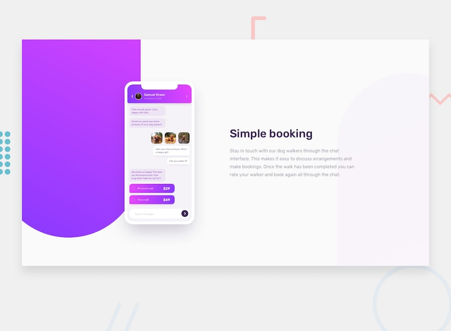

# chat-app-css-illustration-master
## You are welcome to copy the codes and modify them

This project is reference to Amalitech Training, so if you intend to join Amalitech anytime soon for their training [click here](https://amalitech.org/)

# Project

## Building the project
This project was built in [vs code](https://code.visualstudio.com/) and uploaded onto [github](https://github.com).
Google chrome developer tools were used to check how responsive the project was during the build-up.
Google lens was used in relation to google search to find the colors.
When the project was done the deployment website also showed some wrong arrangement in some of the elements and hence reprogramming was done to the codes on github.

## Deploying the project
This project is deployed freely via [netlify](https://netlify.com).
You can [sign up](https://app.netlify.com/signup?) for free connect it with your github.
You are at liberty to choose whether you want netlify to have access to all your github projects or any number of your choice.
